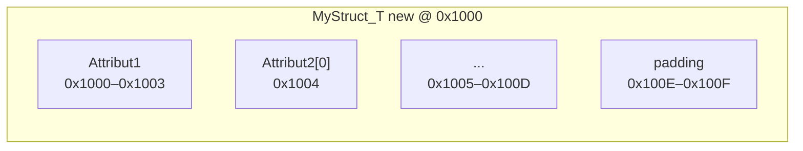

<!---
{
  "id": "56e4d8fa-8d84-405d-b816-62ad9d3973db",
  "depends_on": ["b3531ed1-472f-4448-b60b-c58b9671a0a2"],
  "author": "Stephan Bökelmann",
  "first_used": "2025-07-03",
  "keywords": ["C", "struct", "memory layout", "padding", "addressing"]
}
--->

# Memory Layout and Addressing of C Structs

> In this exercise you will learn how to analyze the memory layout of a `struct` in C, determine its total size including padding, and compute the addresses of its members. Furthermore we will explore how alignment constraints affect field placement and how pointer arithmetic works on struct pointers.

## Introduction

In C, a `struct` groups together variables of potentially different types into a single composite type. Unlike arrays, whose elements must share the same type, structs can include fields such as integers, characters, and arrays. The compiler lays out struct members in memory in the order they appear, but to satisfy alignment requirements each field may be padded. Alignment rules typically mandate that a field of size `N` bytes begins at an address that is a multiple of `N`. For example, a 4‑byte `int` must start at a 4‑byte aligned address.

Consider the definition:

```c
#include <stdio.h>

typedef struct {
    int Attribut1;        // 4 bytes, alignment 4
    char Attribut2[10];   // 10 bytes, alignment 1
} MyStruct_T;
```

When instantiated, the compiler will place `Attribut1` at offset 0. Next, it places `Attribut2` immediately after, at offset 4, since `char[10]` has alignment 1. After the final member, additional padding may be added to ensure that the `struct`’s size is a multiple of its strictest member alignment (in this case 4). Thus, the total `sizeof(MyStruct_T)` will include both field sizes and any trailing padding.

Understanding this layout is crucial when performing pointer arithmetic on struct pointers or when writing binary data to files or hardware. The address of a member can be computed by taking the base address of the struct and adding the member’s offset, e.g.:

```
(char*)&new.Attribut2 - (char*)&new       // yields offset of Attribut2
```

Alternatively, using pointer arithmetic on a struct pointer `p`:

```
&(p->Attribut2) == (char*)p + offsetof(MyStruct_T, Attribut2)
```

where `offsetof` is a macro defined in `<stddef.h>`.

### Further Readings and Other Sources

1. ISO/IEC 9899:2011 Standard (C11), section on *Structure and Union Members*.
2. Guy L. Steele Jr. and Gilad Bracha. *C Programming FAQs*, Addison-Wesley, 2005.
3. cppreference.com, "`offsetof` macro": [https://en.cppreference.com/w/c/types/offsetof](https://en.cppreference.com/w/c/types/offsetof)
4. YouTube, "C Struct Padding Explained": [https://www.youtube.com/watch?v=4JCF7ZP8D80](https://www.youtube.com/watch?v=4JCF7ZP8D80)

## Tasks

### Task 1: Compute Offsets and Total Size

**Problem:** Given the code below and assuming a base address of `0x1000` for the instance `new`, with standard 4‑byte alignment for `int`:

```c
#include <stddef.h>

typedef struct {
    int Attribut1;
    char Attribut2[10];
} MyStruct_T;

int main() {
    MyStruct_T new = {
        .Attribut1 = 10,
        .Attribut2 = "Inhalt!"
    };
    // assume &new == (MyStruct_T*)0x1000
}
```

**Solution Steps:**

1. **Field sizes and alignments**:

   * `int Attribut1`: size = 4, alignment = 4
   * `char Attribut2[10]`: size = 10, alignment = 1
2. **Offset of `Attribut1`**:

   * Placed at offset 0 → spans 0x1000–0x1003
3. **Offset of `Attribut2`**:

   * Next available offset = 4 (no padding needed for `char[10]`)
   * Spans bytes 0x1004–0x100D
4. **Trailing padding**:

   * Struct alignment = max field alignment = 4
   * Current total before padding = 4 + 10 = 14
   * Add padding to reach multiple of 4: 14 % 4 = 2 → padding = 2 bytes
   * Final `sizeof(MyStruct_T)` = 16
5. **Memory layout diagram**:



6. **Addresses of members**:

   * `&new.Attribut1 == (int*)0x1000`
   * `&new.Attribut2 == (char*)0x1004`

---

### Task 2: Pointer Arithmetic on Struct Pointers

**Problem:** Using a pointer `MyStruct_T *p = &new;`, compute the following addresses:

1. `p + 1`
2. `&(p->Attribut2[3])`

**Solution Steps:**

1. **`p + 1`** advances by `sizeof(MyStruct_T)` = 16 bytes:

   * `(MyStruct_T*)0x1000 + 1 == (MyStruct_T*)0x1010`
2. **`&(p->Attribut2[3])`**:

   * Base `p` as `char*` = 0x1000
   * Offset to `Attribut2` = 4 → address of element 0 = 0x1004
   * Additional offset = 3 bytes → 0x1004 + 3 = 0x1007
   * Final address = `(char*)p + 7 == (char*)0x1007`

## Questions

1. Calculate the offset of a hypothetical `short x;` added after `Attribut2`, given `sizeof(short)=2`. What would be `sizeof` including padding?
2. Why is trailing padding necessary in struct layouts?
3. How would the layout change if `Attribut2` were declared before `Attribut1`?

## Advice

Structs provide a powerful way to model complex data, but padding and alignment can introduce surprises when reading or writing raw memory. Always use `offsetof` when computing member positions, and rely on `sizeof` rather than manual sums when allocating or advancing pointers. To deepen your understanding, revisit these layouts with different field orders and types, and explore the [Bitfields and Packing]() sheet for finer control over memory usage.
